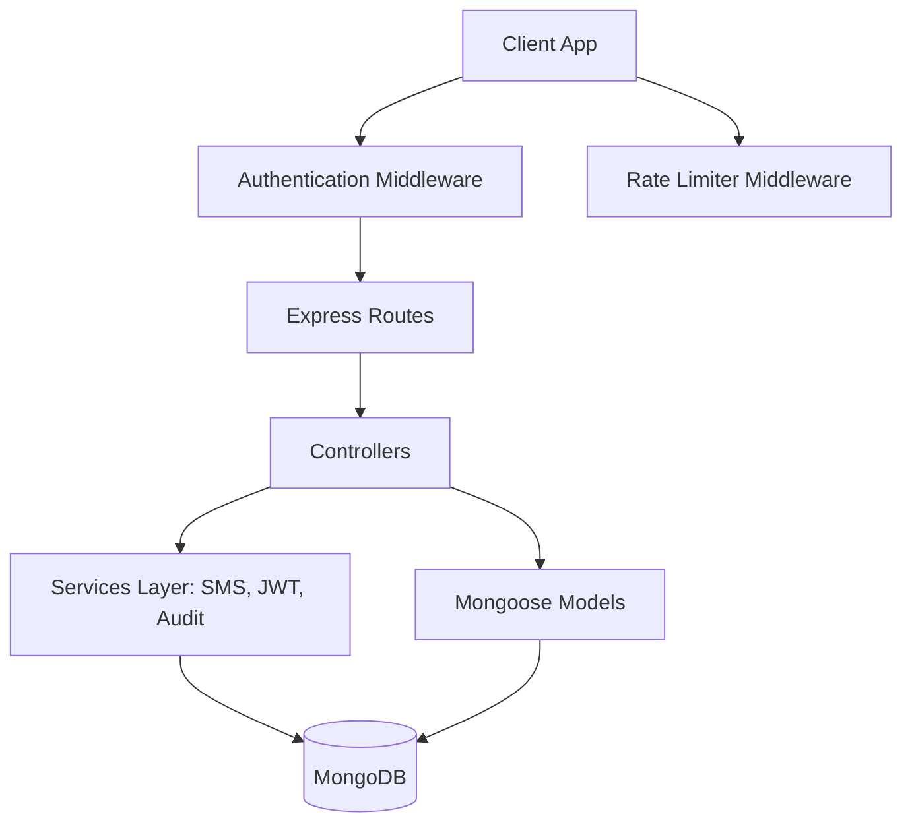

# Implementation Plan — Backend Controllers and Services Development

This plan outlines the architecture, directory structure, detailed logic, and database operations for developing the backend controllers, middlewares, and service layers for the Golden Hour application. 

---

## User Review Required

> [!IMPORTANT]
> To support the security and validation requirements specified in [PAGES_AND_API_SPEC.md](file:///c:/Users/PRANSHU/OneDrive/Desktop/ABHA/PAGES_AND_API_SPEC.md), we propose minor enhancements to our existing schemas:
> 1. **Token Invalidation on Password Reset:** Add `tokenVersion: { type: Number, default: 0 }` to `Patient` schema. This is checked on JWT authentication. Incrementing it on password reset immediately revokes all active patient JWTs.
> 2. **OTP Brute-Force Protection:** Add `failedAttempts: { type: Number, default: 0 }` to both `AbhaRegistration` and `OtpSession` collections to lock them after 5 failed attempts.

---

## Open Questions

> [!NOTE]
> Please review and clarify these design and architectural points:
> 1. **Twilio Credentials:** Should we implement real Twilio SMS and call dispatch using `twilio` SDK (with environment variables `TWILIO_ACCOUNT_SID`, `TWILIO_AUTH_TOKEN`, `TWILIO_PHONE_NUMBER`), and fallback to mock console logging if they are missing?
> 2. **Password Creation in Create ABHA:** The patient needs a password to log in later. Does the client send a `password` field during the final step (`POST /api/abha/create`)? If so, we should validate and bcrypt-hash it.
> 3. **Rate Limiting Store:** Section 5 requires rate limiting on auth routes (5 requests per 15 mins). Can we use a basic memory-store based rate limiter (like `express-rate-limit`), or is a Redis/persistent store required?

---

## Proposed Component Architecture

---

## Proposed Changes

### 1. Middleware System

#### [NEW] [auth.js](file:///c:/Users/PRANSHU/OneDrive/Desktop/ABHA/golden-hour-backend/src/middleware/auth.js)
Contains JWT verification and authorization gates.
* **`authenticate` middleware:** Extracts the Bearer token from the `Authorization` header, decodes it using `jsonwebtoken`, checks user existence, and verifies `tokenVersion` matches (if patient). Attaches the decoded user to `req.user` (with `id`, `role`, and other claims).
* **`authorize(roles)` middleware:** Factory function that checks if `req.user.role` is included in the permitted `roles` array (e.g., `['staff']`, `['facility']`, `['patient']`). Returns `403 Forbidden` if unauthorized.

#### [NEW] [rateLimiter.js](file:///c:/Users/PRANSHU/OneDrive/Desktop/ABHA/golden-hour-backend/src/middleware/rateLimiter.js)
* **`authLimiter` middleware:** Uses `express-rate-limit` to restrict requests on public authentication routes (`/api/auth/*` and `/api/abha/*`) to 5 requests per 15 minutes per IP address. Returns `429 Too Many Requests`.

---

### 2. Core Service Abstractions

#### [NEW] [audit.service.js](file:///c:/Users/PRANSHU/OneDrive/Desktop/ABHA/golden-hour-backend/src/services/audit.service.js)
* **`logAccess(logData)` function:** Helper to create immutable entries in the `audit_logs` collection.
  * Inputs: `patientId`, `actorType`, `actorId`, `actorName`, `facilityName`, `dataAccessed`, `accessType`, `tone`.
  * Action: Instantiates a new `AuditLog` document and saves it. Catches errors silently or logs them to the console to ensure main request execution does not fail.

#### [NEW] [notification.service.js](file:///c:/Users/PRANSHU/OneDrive/Desktop/ABHA/golden-hour-backend/src/services/notification.service.js)
* **`sendSms(to, body)`:** Dispatches SMS using the Twilio client or logs to console if Twilio is unconfigured.
* **`triggerEmergencyCall(to, message)`:** Uses Twilio Voice API to initiate an automated call and plays text-to-speech message utilizing a dynamically generated TwiML URL.

---

### 3. Controller Layer

#### [NEW] [auth.controller.js](file:///c:/Users/PRANSHU/OneDrive/Desktop/ABHA/golden-hour-backend/src/controllers/auth.controller.js)

Controls the login, session management, and password recovery.

* **`patientLogin(req, res)`**
  * **Endpoint:** `POST /api/auth/patient/login` (Public)
  * **Input Verification:** `identifier` (mobile number or ABHA address) and `password` required.
  * **Logic:**
    1. Search `Patient` collection by `mobileNumber` or `abhaAddress`.
    2. If not found or password verification (`bcrypt.compare`) fails, return `401 Unauthorized`.
    3. Generate a JWT token signed with JWT secret, specifying `{ sub: patient._id, role: 'patient', tokenVersion: patient.tokenVersion }`, expiring in 7 days.
    4. Return status `200` with the token and profile subset (`id`, `abhaId`, `abhaAddress`, `fullName`).

* **`staffLogin(req, res)`**
  * **Endpoint:** `POST /api/auth/staff/login` (Public)
  * **Input Verification:** `hpid` (must match regex `HPID-\d{2}-\d{4}-\d{4}-\d{4}`) and `pin` (6-digit string) required.
  * **Logic:**
    1. Search `StaffCredential` by `hpid` and ensure `active: true`.
    2. If not found or PIN verification (`bcrypt.compare`) fails, return `401 Unauthorized`.
    3. Update `lastLoginAt = Date.now()` on the document.
    4. Generate JWT signed token with `{ sub: staff._id, role: 'staff' }` expiring in 8 hours.
    5. Return status `200` with token and staff subset (`id`, `name`, `specialization`).

* **`facilityLogin(req, res)`**
  * **Endpoint:** `POST /api/auth/facility/login` (Public)
  * **Input Verification:** `hfrId` (regex `IN-HFR-\d{4}-\d{4}`), `staffEmployeeId` (regex `EMP-\d{6}`), and `password` required.
  * **Logic:**
    1. Search `FacilityCredential` where `hfrId` and `staffEmployeeId` match, and `active: true`.
    2. If not found or password fails verification, return `401 Unauthorized`.
    3. Update `lastLoginAt = Date.now()`.
    4. Generate JWT token with `{ sub: facility._id, role: 'facility' }` expiring in 12 hours.
    5. Return status `200` with token and facility subset (`id`, `facilityName`, `city`, `state`).

* **`forgotPasswordSendOtp(req, res)`**
  * **Endpoint:** `POST /api/auth/patient/forgot` (Public)
  * **Input Verification:** `method` ('mobile' or 'abha') and `identifier` required.
  * **Logic:**
    1. Look up `Patient` by `mobileNumber` (if method is 'mobile') or `abhaAddress`/`abhaId` (if method is 'abha').
    2. If patient not found, return `404 Not Found` (or a generic message if security dictates obfuscation, but the spec asks for `404`).
    3. Generate a random 6-digit numeric OTP.
    4. Hash OTP with `bcrypt`.
    5. Create an `OtpSession` document: `method`, `identifier` (lowercased), `otpHash`, `expiresAt` (now + 10 mins).
    6. Send the plain OTP code to the patient's registered mobile number using `NotificationService.sendSms`.
    7. Return status `200` with `sessionId` and a masked mobile number (e.g., `+91 9822XXXXXX`).

* **`forgotPasswordVerifyOtp(req, res)`**
  * **Endpoint:** `POST /api/auth/patient/verify-otp` (Public)
  * **Input Verification:** `sessionId` and `otp` (6-digits) required.
  * **Logic:**
    1. Find `OtpSession` by `sessionId`. If not found, return `404 Not Found`.
    2. If `expiresAt` is in the past, return `410 Gone` (expired).
    3. Check `failedAttempts`. If `failedAttempts >= 5`, return `429 Too Many Requests`.
    4. Match `otp` with `otpHash`.
    5. If mismatch: increment `failedAttempts` on the session. If it hits 5, mark session as unusable. Return `400 Bad Request`.
    6. If matches: set `verified: true`, `failedAttempts: 0`. Save.
    7. Return status `200` with `{ sessionId, verified: true }`.

* **`forgotPasswordReset(req, res)`**
  * **Endpoint:** `POST /api/auth/patient/reset-password` (Public)
  * **Input Verification:** `sessionId`, `newPassword` (min 8 chars), and `confirmPassword` required.
  * **Logic:**
    1. Check if `newPassword !== confirmPassword`. If so, return `400 Bad Request`.
    2. Fetch `OtpSession` by `sessionId`. If not found, return `404 Not Found`.
    3. Check if session has expired or `used: true`. If so, return `410 Gone`.
    4. Check if `verified` is false. If so, return `422 Unprocessable Entity`.
    5. Fetch `Patient` by corresponding `identifier` from the session.
    6. Hash `newPassword` using `bcrypt` (rounds = 12).
    7. Update Patient's `passwordHash` and increment `tokenVersion` by 1. Save patient.
    8. Update OtpSession to `used: true`. Save session.
    9. Return status `200` with `{ reset: true, message: "Password updated — all sessions signed out." }`.

---

#### [NEW] [abha.controller.js](file:///c:/Users/PRANSHU/OneDrive/Desktop/ABHA/golden-hour-backend/src/controllers/abha.controller.js)

Controls the 4-step wizard registration for creating an ABHA record.

* **`sendOtp(req, res)`**
  * **Endpoint:** `POST /api/abha/send-otp` (Public)
  * **Input Verification:** `aadhaarNumber` (12 digits), `mobileNumber`, and `consentGiven` (must be boolean `true`).
  * **Logic:**
    1. If `consentGiven` is false/missing, return `422 Unprocessable Entity`.
    2. Validate `aadhaarNumber` matches `/^\d{12}$/`. If invalid, return `400 Bad Request`.
    3. Compute Aadhaar hash using `crypto.createHash('sha256').update(aadhaarNumber).digest('hex')`.
    4. Generate random 6-digit OTP, and bcrypt-hash it.
    5. Save/upsert `AbhaRegistration` entry: setting status to `otp_pending`, storing `aadhaarHash`, `mobileNumber`, `otpHash`, `consentGiven`, and `otpExpiresAt` (now + 10 mins).
    6. Call `NotificationService.sendSms` to dispatch plain OTP to mobile number.
    7. Return status `200` with `registrationId` and masked mobile number.

* **`verifyOtp(req, res)`**
  * **Endpoint:** `POST /api/abha/verify-otp` (Public)
  * **Input Verification:** `registrationId` and `otp` (6-digits) required.
  * **Logic:**
    1. Find `AbhaRegistration` by `registrationId`. If not found, return `404`.
    2. Check expiration. If `otpExpiresAt` is passed, return `410`.
    3. Check `failedAttempts`. If `>= 5`, return `429` (locked).
    4. Compare `otp` with `otpHash`.
    5. If mismatch: increment `failedAttempts`. If `>= 5`, update status to `failed`. Return `400`.
    6. If matches: set status to `otp_verified`, `failedAttempts: 0`, and clear `otpHash`. Save document.
    7. Return status `200` with `{ registrationId, status: "otp_verified" }`.

* **`createAbha(req, res)`**
  * **Endpoint:** `POST /api/abha/create` (Public)
  * **Input Verification:** `registrationId`, profile fields (`fullName`, `dob`, `gender`, `address`, `bloodGroup`, `abhaHandle`, `password`). Optional profile fields: `weight_kg`, `height_cm`, `emergencyContact`.
  * **Logic:**
    1. Fetch `AbhaRegistration` by `registrationId`. If not found, return `404`.
    2. Ensure `status` is `otp_verified`. If not, return `422`.
    3. Validate `abhaHandle` against regex `/^[a-z0-9._]+$/` (min 3 chars). If invalid, return `400`.
    4. Check handle availability: Search if `abhaAddress` `${abhaHandle}@abdm` already exists in `Patient` collection. If yes, return `409 Conflict`.
    5. Generate a unique 14-digit `abhaId` string.
    6. Hash `password` using `bcrypt` (rounds = 12).
    7. Create new `Patient` document copying registration data (`mobileNumber`, `aadhaarHash`, `consentGiven`) along with body data. Set `consentAt = Date.now()`.
    8. Update `AbhaRegistration` to status `completed` and link `patientId: patient._id`.
    9. Create an audit log entry: `accessType: "registration"`, `tone: "ok"`, `dataAccessed: "Profile details"`, `actorName: patient.fullName`.
    10. Generate JWT token for this patient (`sub: patient._id, role: 'patient'`).
    11. Return status `201` with `abhaId`, `abhaAddress`, `fullName`, `bloodGroup`, and the login JWT `token`.

* **`checkAddress(req, res)`**
  * **Endpoint:** `GET /api/abha/check-address` (Public)
  * **Input Verification:** `handle` query parameter required.
  * **Logic:**
    1. If `handle` regex `/^[a-z0-9._]+$/` fails, return `400`.
    2. Query `Patient` collection to see if `abhaAddress` `${handle.toLowerCase()}@abdm` is taken.
    3. Return `200` with `{ available: !isTaken }`.

---

#### [NEW] [emergency.controller.js](file:///c:/Users/PRANSHU/OneDrive/Desktop/ABHA/golden-hour-backend/src/controllers/emergency.controller.js)

Controls staff operations on patients during emergency situations.

* **`getPatientRecord(req, res)`**
  * **Endpoint:** `GET /api/emergency/patient/:abhaId` (Auth Required: role `staff`)
  * **Logic:**
    1. Search `Patient` by `abhaId`. If not found, return `404`.
    2. Fetch all conditions of this patient from `Condition` collection.
    3. Retrieve the patient's latest `DischargeEntry` document where `allergy` is not null. Extract `allergy` object for the response `allergies` array.
    4. Retrieve the patient's latest `DischargeEntry` documents where `highRiskMed` or `diabetes` is not null. Compile a clean `medications` array (mapping the high-risk drug details or synthetic insulin pathways).
    5. Create an emergency audit log using `AuditService`:
       - `patientId`: patient._id
       - `actorType`: "staff"
       - `actorId`: req.user.id
       - `actorName`: `${req.user.name} (HPID-${req.user.hpid})`
       - `dataAccessed`: "Full emergency record"
       - `accessType`: "emergency"
       - `tone`: "emergency"
    6. Return status `200` with patient details, conditions, allergies, medications, and emergency contacts.

* **`notifyFamily(req, res)`**
  * **Endpoint:** `POST /api/emergency/patient/:abhaId/notify-family` (Auth Required: role `staff`)
  * **Logic:**
    1. Search `Patient` by `abhaId`. If not found, return `404`.
    2. Check if primary or secondary emergency contact numbers are present. If both are empty, return `422 Unprocessable Entity` ("No emergency contacts on file").
    3. Formulate text messages: *"EMERGENCY: Patient [Name] has been admitted to Emergency Care. Please check portal or contact staff immediately."*
    4. Call `NotificationService.sendSms` for all available emergency numbers.
    5. Call `NotificationService.triggerEmergencyCall` to call contacts with a read-out.
    6. Return status `200` with `{ notified: true, timestamp: Date.now() }`.

---

#### [NEW] [facility.controller.js](file:///c:/Users/PRANSHU/OneDrive/Desktop/ABHA/golden-hour-backend/src/controllers/facility.controller.js)

* **`getPatientContext(req, res)`**
  * **Endpoint:** `GET /api/facility/patient/:abhaId` (Auth Required: role `facility`)
  * **Logic:**
    1. Search `Patient` by `abhaId`. If not found, return `404`.
    2. Write an audit log entry:
       - `patientId`: patient._id
       - `actorType`: "facility"
       - `actorId`: req.user.id
       - `actorName`: req.user.staffEmployeeId
       - `facilityName`: req.user.facilityName
       - `dataAccessed`: "Patient identity"
       - `accessType`: "discharge"
       - `tone`: "warn"
    3. Return status `200` with `{ patient: { abhaId, fullName } }`.

---

#### [NEW] [discharge.controller.js](file:///c:/Users/PRANSHU/OneDrive/Desktop/ABHA/golden-hour-backend/src/controllers/discharge.controller.js)

Controls the submission of clinical discharge reports.

* **`submitDischarge(req, res)`**
  * **Endpoint:** `POST /api/discharge` (Auth Required: role `facility`)
  * **Input Verification:** `patientAbhaId` (required), optional clinical sub-sections: `allergy`, `diabetes`, `implant`, `bloodThinner`, `highRiskMed`, and `doctorNote`.
  * **Validation Rules:**
    - Look up Patient by `patientAbhaId`. If not found, return `404`.
    - If `allergy` section present: check all 4 sub-fields exist, check `epinephrineRequired` is a boolean.
    - If `diabetes` section present: check all 3 sub-fields exist, check `hba1cPercent` is a number between 3.0 and 20.0, check `dkaHistory` is boolean.
    - If `implant` section present: check all 3 sub-fields exist, check `mriClass` matches enum (`MR-Safe`, `MR-Conditional`, `MR-Unsafe`).
    - If `bloodThinner` section present: check all 4 sub-fields exist, check `lastDoseAt` is a valid ISO date, check `targetInr` is a number between 1.0 and 5.0, check `reversalAgent` matches enum.
    - If `highRiskMed` section present: check all 4 sub-fields exist, check `apinchsCategory` matches enum, check `route` matches enum.
    - Validate `doctorNote` does not exceed 100 words (count words by splitting on `\s+`).
    - Ensure at least one section is present or `doctorNote` is not empty. If validation fails, return `400 Bad Request` with validation error details.
  * **Logic:**
    1. Parse and create a `DischargeEntry` document linked to `patientId: patient._id` and `facilityId: req.user.id`.
    2. Hardcode `admittedAt` to a historical default (e.g. 10 days before current time, or standard 7-10 days historical context as per spec) or read it if available.
    3. Set `reviewedAndConfirmed: true`.
    4. Save the document.
    5. Log the audit entry:
       - `patientId`: patient._id
       - `actorType`: "facility"
       - `actorId`: req.user.id
       - `actorName`: req.user.staffEmployeeId
       - `facilityName`: req.user.facilityName
       - `dataAccessed`: "Discharge entry submission"
       - `accessType`: "discharge"
       - `tone`: "warn"
    6. Return status `201 Created` with `{ dischargeId: doc._id, submittedAt: doc.submittedAt }`.

---

#### [NEW] [patient.controller.js](file:///c:/Users/PRANSHU/OneDrive/Desktop/ABHA/golden-hour-backend/src/controllers/patient.controller.js)

Handles operations inside the patient self-portal dashboard.

* **`getProfile(req, res)`**
  * **Endpoint:** `GET /api/patient/me` (Auth Required: role `patient`)
  * **Logic:**
    1. Retrieve `Patient` by `_id: req.user.id`. If not found, return `404`.
    2. Write an audit log entry:
       - `patientId`: req.user.id
       - `actorType`: "patient"
       - `actorId`: req.user.id
       - `actorName`: patient.fullName
       - `facilityName`: "Self Portal"
       - `dataAccessed`: "Profile details"
       - `accessType`: "self"
       - `tone`: "ok"
    3. Fetch all self-reported conditions from `Condition` collection where `patientId` matches.
    4. Return status `200` with profile subset (excluding password hash/Aadhaar hash) and conditions.

* **`getAuditLogs(req, res)`**
  * **Endpoint:** `GET /api/patient/me/audit-log` (Auth Required: role `patient`)
  * **Input Verification:** `page` (default 1), `limit` (default 20) query parameters.
  * **Logic:**
    1. Parse pagination queries.
    2. Query `AuditLog` collection where `patientId: req.user.id`.
    3. Sort by `createdAt` descending. Apply `.skip((page - 1) * limit).limit(limit)`.
    4. Calculate `total` count.
    5. Return status `200` with `{ total, page, logs }`.

* **`addCondition(req, res)`**
  * **Endpoint:** `POST /api/patient/me/conditions` (Auth Required: role `patient`)
  * **Input Verification:** `name` is required. `since` and `notes` are optional.
  * **Logic:**
    1. If `name` is missing or empty, return `400 Bad Request`.
    2. Save a new `Condition` document: `patientId: req.user.id`, `name`, `since`, `notes`.
    3. Return status `201 Created` with the created condition document subset.

* **`removeCondition(req, res)`**
  * **Endpoint:** `DELETE /api/patient/me/conditions/:conditionId` (Auth Required: role `patient`)
  * **Logic:**
    1. Search and delete `Condition` where `_id: conditionId` and `patientId: req.user.id`.
    2. If document not found, return `404 Not Found`.
    3. Return status `200` with `{ deleted: true }`.

* **`updateEmergencyContacts(req, res)`**
  * **Endpoint:** `PUT /api/patient/me/emergency-contacts` (Auth Required: role `patient`)
  * **Input Verification:** `primaryContact` and `secondaryContact` fields in body.
  * **Logic:**
    1. Check that at least one contact is provided. If both are empty, return `400 Bad Request`.
    2. Update patient document where `_id: req.user.id` setting fields `primaryContact` and `secondaryContact`.
    3. Return status `200` with updated emergency contacts.

* **`requestCard(req, res)`**
  * **Endpoint:** `POST /api/patient/me/request-card` (Auth Required: role `patient`)
  * **Logic:**
    1. Fetch `Patient` by `_id: req.user.id`.
    2. Check if `cardRequested` is already `true`. If so, return `409 Conflict` ("Card replacement already requested").
    3. Update patient: `cardRequested: true`, `cardRequestedAt: Date.now()`.
    4. Return status `200` with `{ cardRequested: true, cardRequestedAt }`.

---

## Verification Plan

### Automated Tests
* We will write integration tests in the `golden-hour-backend/tests` folder utilizing `supertest` to verify routing, validation rules, error handling, rate limiting, and JWT roles:
  * Run tests with: `npm test` or a custom test runner script.

### Manual Verification
* Perform end-to-end API validations using Postman or a custom verification script inside `scratch/` folder:
  1. Login with Staff / Facility / Patient dummy credentials.
  2. Perform registration steps, verifying OTPs and invalidating duplicate registrations.
  3. Validate database changes by reading audit log and patients collections directly using a database explorer tool.
